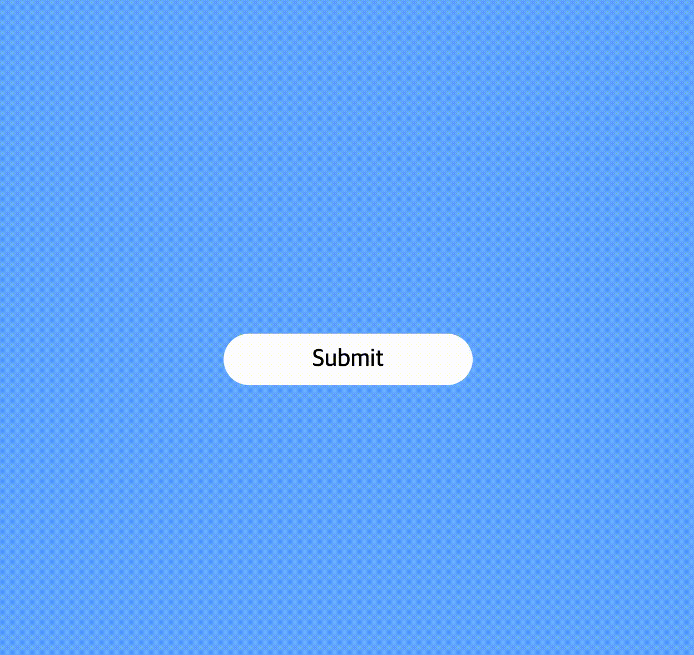
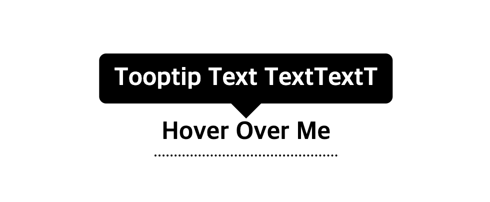
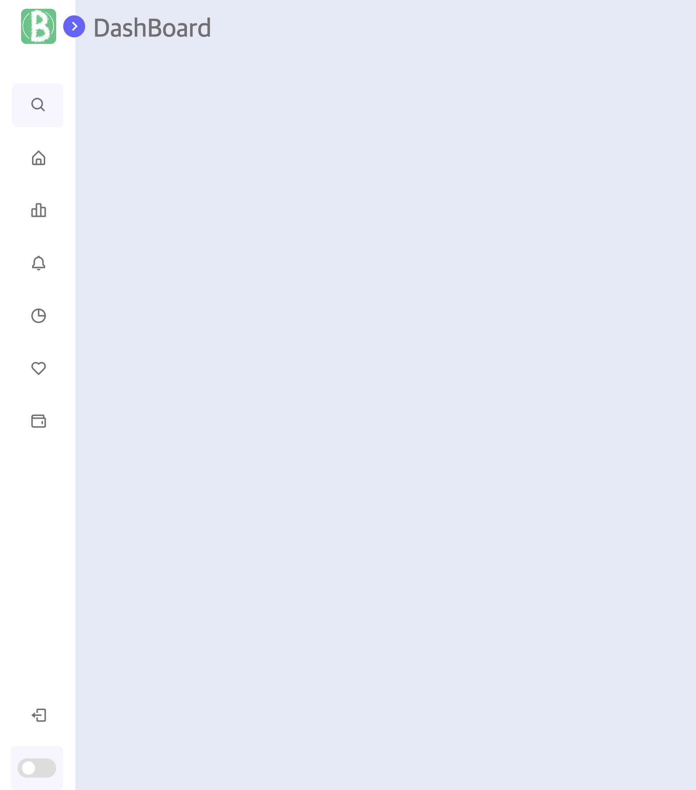
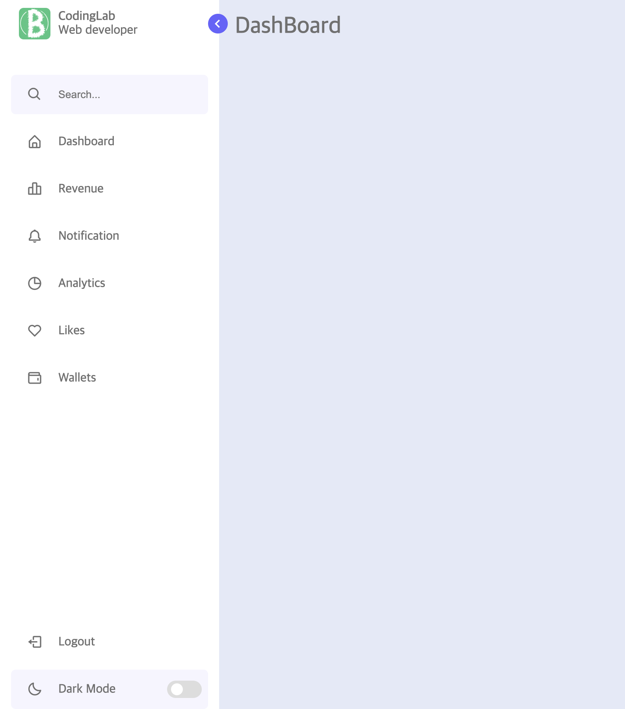
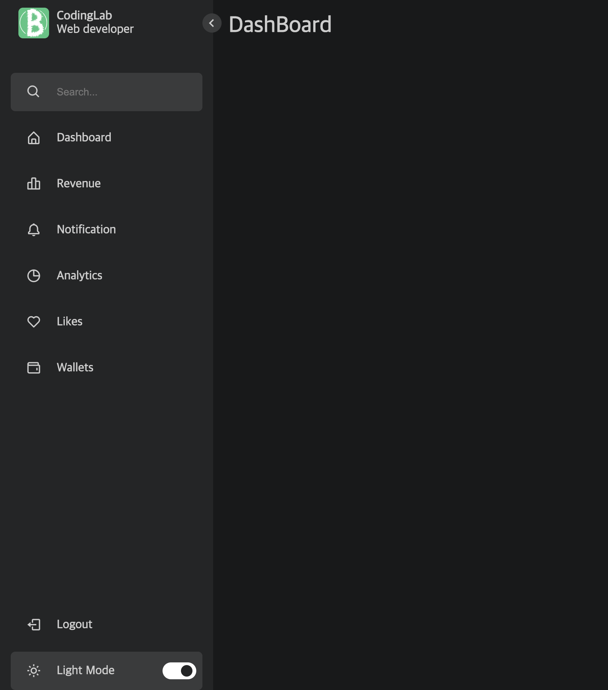
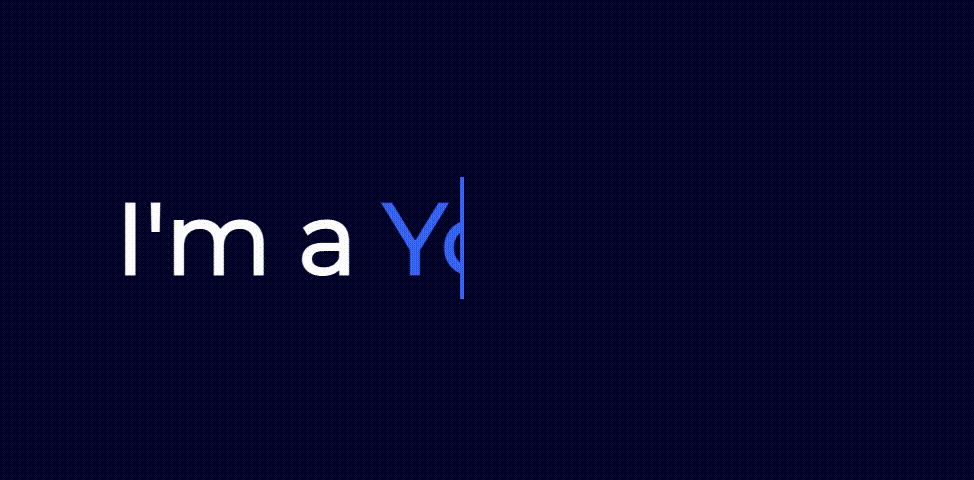

# Reference

## [1. submit_popup_animated](./1_submit_popup_animated/)
자료: [youtube](https://www.youtube.com/watch?v=AobDmYWOY34)

Preview



### 콘텐츠를 가운데 정렬
```html
display: flex;
justify-content: center; //수평 정렬
align-items: center; //수직 정렬
```
또는
```html
position: absolute;
left: 50%; /* 부모 요소의 width 50%만큼 오른쪽으로 띄워둠. */
transform: translateX(-50%); /* 자기 요소의 width 50%만큼을 왼쪽으로 다시 이동함. */
```
- transform 주의점: 이동하기 전 요소가 있던 영역이 차지하는 부분이 완전히 사라지는 건 아니다. 다른 형제 요소들은 해당 요소가 transform 후에도 이전처럼 동작함.

### px, em, rem, vh, vw단위들의 차이점

절대 길이 단위.
- px: 절대 길이 단위. 픽셀 단위. 

상대 길이 단위. (글꼴 크기)
- em: 글꼴의 크기를 나타냄. 상위 요소의 글꼴크기에 비례한다.
- rem: 똑같이 글꼴의 크기를 나타냄. 상위 요소가 아닌 root(html요소)가 되는 요소의 크기에 비례한다.

상대 길이 단위. (요소 크기)  
반응형 웹을 만든다고 했을 때 `%`단위만 사용하는 건 한계가 있다. 이때 vw, vh가 쓰인다.  
vw, vh는 viewport 크기의 1/100 단위임. (ex. 브라우저 창 높이가 700px일 때 1vh=7px)
- vw: vertical height의 약자.
- vh: vertical width의 약자.

## [2. tooltip](./2_tooltip/)
자료: [youtube](https://www.youtube.com/watch?v=qdiUrCnuCjI&t)

Preview  


### box-sizing
`box-sizing: content-box | border-box | initial | inherit`
content-box : 콘텐트 영역을 기준으로 크기를 정한다.
border-box : 테두리를 기준으로 크기를 정한다.(테두리포함)
initial : 기본값으로 설정한다.
inherit : 부모 요소의 속성값을 상속받는다.

### ::before
`::before` 은 선택한 요소의 첫 자식으로 의사요소(?)를 하나 생성함. 보통 `content` 속성과 함께쓰는데, 요소에 장식용 콘텍츠를 추가할 때 사용한다.
> 의사요소(가상요소): 선택자에 추가하는 키워드. 선택한 요소의 일부분에만 스타일을 입할 수 있음.  
> ex. `::first-line` 을 사용하면 문단 첫 줄의 글씨체만 바꿀 수 있음.
> ```css
> /* The first line of every <p> element. */
> p::first-line {
>   color: blue;
>   text-transform: uppercase;
> }
> ```

### 말풍선 뾰족한 부분 만들기
```css
border: 15px solid;
border-color: #000 #0000 #0000 #0000; /* 이걸로 말풍선 뾰족한 모양을 만듦. (rgba의 a(opacity) 속성 이용한 형태)*/
```
> opacity: 16진수로 표현.(0~F로 표현)


## [3. sidebar](./3_sidebar/)
자료: [youtube](https://www.youtube.com/watch?v=bFvfqUMjvsA)

Preview
|sidebar 접었을 때|sidebar 열었을 때|dark mode|
|------|---|---|
||||

### `<nav></nav>` 태그를 쓰는 이유?
태그 의미: 웹 내 navigation 역할을 함. 보통 메뉴, 목차, 인덱스 등에 사용됨. **스크린 리더기 같은 브라우저는 `<nav>` 를 이용해 해당 콘텐츠의 초기 렌더링을 생략할지 여부를 결정함**. 즉, 스크린리더를 사용할 경우 tab, 방향키 등을 사용해 페이지에서 원하는 정보를 얻을 수 있는데 이때, 네비게이션 영역에 해당하는 다소 불필요한 정보들은 건너뛰는 기능(스킵 네이게이션이라 함)을 위해 `<nav>` 태그를 사용한다는 뜻.

> 시멘틱 태그: 의미를 부여한 태그. div 이용해도 되지만, 굳이 header, footer를 쓰는 이유는 (1)문서의 가독성이 좋아지고 유지보수가 쉬워지기 때문. (목적별 의미 부여) (2) SEO에도 좋다. (검색 용이) (3)**또 이게 시각장애인들이 사이트를 이용할 때 화면의 텍스트를 읽어주는 스크린 리더기 등을 통해 활용될 수 있음.(웹 접근성 확보)**

> 웹 접근성 향상시키기에 참고하기 좋은 글 : https://web-for-all.tistory.com/3

### dark mode
- css의 변수 기능을 활용해 dark mode/light mode시 색상을 바꿀 수 있다.
- 모드 변경될시 색상이 바뀌는 모든 부분을 대상으로 애니메이션 소요 시간을 통일시켜주면 변환이 더 깔끔해진다.

### Element.classList#toggle()
- `toggle()` : 인자에 해당하는 클래스명이 있으면 제거, 없으면 추가해주는 메서드. (dark mode 변환시, 사이드바 close/open시 사용하기 좋음)

### transition, transform, animation의 차이
- transition: 특정 속성을 duration에 따라 변화하게 한다.
- transform: 요소에 이동(translate), 회전(rotate), 확대/축소(scale), 비틀기(skew) 효과를 준다.
    > 애니메이션 효과를 주는건아니라서, 애니메이션 효과를 같이 주려면 transition과 함께 사용하면 된다.
- animation: 요소에 애니메이션 효과를 적용시켜 준다. 키워드 `@keyframes`를 사용해 시간에 따른 효과를 정의할 수 있다.
    > transition과 차이점: transition은 요소가 로드되자마자 바로 발동되는게 아님. 요소 속성 값이 변화할 때 반응한다. 반면 animation은 요소의 **재생,정지,반복**을 포함한 세부 흐름을 시간 단위로 설정할 수 있다.


## [4. sidebar](./4_text_cursor_animation/)
자료: [youtube](https://www.youtube.com/watch?v=nxoHR9lltK0)

preview



### overflow:hidden
- overflow: 주어진 공간이 모자라 넘치는 컨텐츠를 어떻게 보여줄지 결정. 
    - `visible`(기본) : 공간을 넘어가 컨텐츠를 다 보여줌
    - `hidden` : 주어진 공간내에 담을 수 있는 양만 보여줌